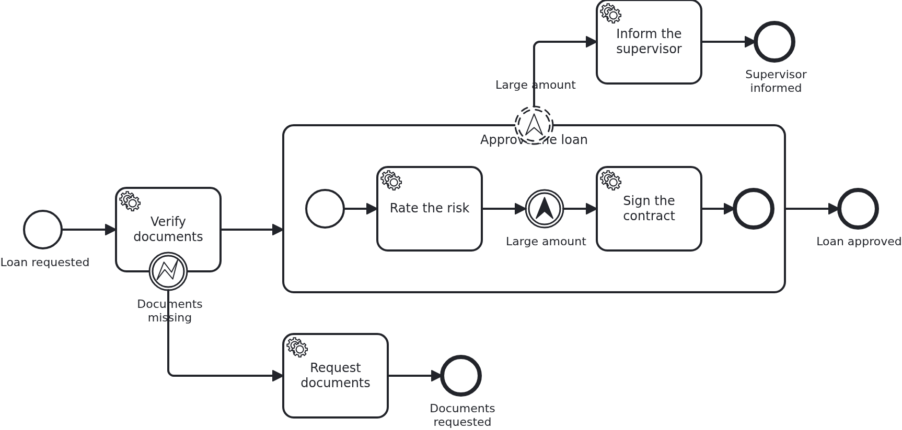

# Errors and escalations

[](./LICENSE)

BPMN has two ways of saying that something went differently than planned, and they are not
interchangeable. An error says "this activity cannot be completed", an escalation says
"somebody should know, and work carries on". This blueprint has one of each in the same
process.

## What this blueprint shows



Two ways out of the ordinary path:

- **The error comes from business code.** `Service#verifyDocuments` throws
  `TaskException("documents-missing")` when the documents are incomplete. The task ends,
  the interrupting error boundary event routes the workflow, and everything the handler
  wrote before throwing is committed - a BPMN error is a business outcome, not a failure.
  An error boundary event is always interrupting, because the activity could not be
  completed.
- **The escalation comes from the model.** Inside the subprocess an escalation throw event
  reports the large amount, a non-interrupting boundary event catches it, and the supervisor
  is informed on a branch of its own **while the subprocess carries on** and signs the
  contract. No line of Java knows that this happens.

That second point is worth being explicit about: **VanillaBP has no API for raising an
escalation.** `TaskException` maps to a BPMN error, and there is no counterpart. Whether
something escalates is a decision the model takes - a gateway routing to a throw event,
where the process needs it. Business code writes what it knows onto the aggregate, and the
model decides what that means for the flow, which is the same division of labour the
gateways blueprint shows.

For the application, both branches are ordinary tasks. A task inside a subprocess is wired
exactly like one outside it, and the branch behind the escalation is a task like any other -
the nesting and the event are the model's business.

## Delta to the base blueprint

Compared to [`module-single`](https://github.com/vanillabp-blueprints/module-single-springboot):

|            File            |                                              What is different                                               |
|----------------------------|--------------------------------------------------------------------------------------------------------------|
| `loan_approval.bpmn`       | an error boundary event on the first task, and a subprocess throwing an escalation caught non-interruptingly |
| `Service.java`             | throws `TaskException` for the error; one method per branch                                                  |
| `WorkflowTaskHandler.java` | a `@WorkflowTask` method per task, inside and outside the subprocess                                         |
| `Aggregate.java`           | what each branch wrote, which is how the tests tell the two ways out apart                                   |
| `loan-approval.yaml`       | the amount below which the documents count as incomplete                                                     |
| `LoanApprovalIT.java`      | one test per way out                                                                                         |

## Running it

Requires a JDK 21. Camunda 7 is embedded, so nothing else has to run:

```bash
mvn install verify
```

Running it on another BPMS is a Maven profile, not one line of Java changes:

```bash
mvn install verify -Pcamunda8
```

Camunda 8 is a remote engine, so a cluster has to run and be pointed at. Start one, then add
its address to `application/src/main/resources/application.yaml` and to
`loan-approval/src/test/resources/application.yaml`:

```yaml
vanillabp:
  adapters:
    camunda8:
      rest-address: http://localhost:8080
      # Nothing else is needed: this adapter keeps workflow modules apart by nothing at all
      # ('name-clash-avoidance: none') unless told otherwise, because a cluster started from
      # the stock image has multi-tenancy switched off and rejects a tenant per module. The
      # adapter warns about it while booting - with one workflow module the identifiers are
      # unique anyway. Set 'name-clash-avoidance: use-prefix' to have VanillaBP prefix them.
```

Without it the application does not boot, and says so:

```
Camunda 8 adapter 'camunda8' is used but not configured: the property
'vanillabp.adapters.camunda8.rest-address' is missing.
```

That is the normal way to work with VanillaBP: configuration is validated while booting, and
the message names what to do.

Start the application:

```bash
mvn -pl application spring-boot:run
```

Booting logs a warning per workflow module, and it is meant to be read rather than filtered
away. Both Camunda adapters start out with `name-clash-avoidance: none`, so the identifiers
of this module reach the engine as they are, and the adapter names what it could do instead
and asks for a decision. With one workflow module nothing can collide, which is why this
blueprint leaves the setting alone and keeps its configuration free of `vanillabp.*`. An
application that wants the question answered answers it once:

```yaml
vanillabp:
  adapters:
    camunda7:
      accept-unscoped-identifiers: true
```

That is a promise that the identifiers are unique across all workflow modules, and it turns
the warning into a debug line. Which modes a BPMS offers, and why switching the mode later is
a migration rather than a configuration change, is in
[the wiki](https://github.com/vanillabp/adapter-platform-integration/wiki/Workflow-modules#how-name-clashes-are-avoided).

Start a loan approval. This is the only URL you need:

```
http://localhost:8080/api/loan-approval/start?amount=5000
```

The documents are complete, the subprocess runs, and the escalation informs the supervisor
beside it:

```
Loan approval '0f7c…' started
Credit rating of loan approval '0f7c…' is 50
The supervisor was informed about loan approval '0f7c…'
The contract of loan approval '0f7c…' was signed
```

Ask for less than the configured amount and the documents count as incomplete, so the error
path is taken and the subprocess is never entered:

```
http://localhost:8080/api/loan-approval/start?amount=500
```

```
Loan approval '4b21…' has incomplete documents
Documents were requested for loan approval '4b21…'
```

While the application runs on Camunda 7, Camunda's own web applications are served at
`http://localhost:8080/camunda`, with `demo` / `demo` as the login. The user comes from
`application/src/main/camunda7/resources/camunda7-webapps.yaml`; an application with an
identity provider of its own leaves that section out. The Camunda 8 profile ships neither
the dependency nor that file.

While the application runs on Camunda 7, Camunda's own web applications are served at

```
http://localhost:8080/camunda
```

Log in with `demo` / `demo`. Cockpit shows what the engine is doing with the workflows
started above, which is the view the logged URLs cannot give: where an instance stands, and
why a job failed. The user comes from
`application/src/main/camunda7/resources/camunda7-webapps.yaml` and exists so that the
blueprint can be operated without setting one up; an application with an identity provider
of its own leaves that section out.

The Camunda 8 profile ships neither the dependency nor that file. Its tooling is part of
the cluster, and the file names a Camunda 7 adapter id, which VanillaBP would rightly
refuse to start with.

## How it works

|                                          File                                          |                                                        Role                                                         |
|----------------------------------------------------------------------------------------|---------------------------------------------------------------------------------------------------------------------|
| `loan-approval/src/main/resources/META-INF/workflow-module`                            | contains `loan-approval` and thereby declares this JAR to be a workflow module                                      |
| `loan-approval/src/main/resources/loan-approval/processes/camunda7/loan_approval.bpmn` | the process: start event, service task, end event. The task names the method implementing it                        |
| `.../loanapproval/model/Aggregate.java`                                                | the workflow aggregate, a normal JPA entity keyed by the loan request ID                                            |
| `.../loanapproval/Service.java`                                                        | the business code: builds the aggregate and tells `Workflow` that a loan was requested                              |
| `.../loanapproval/Workflow.java`                                                       | what the application tells the process; the only class using `ProcessService`                                       |
| `.../loanapproval/WorkflowTaskHandler.java`                                            | what the process tells the application: `@WorkflowService`, `@WorkflowTask`, calls `Service`                        |
| `.../loanapproval/ApiController.java`                                                  | the GET endpoints operating the process                                                                             |
| `.../loanapproval/config/LoanApprovalProperties.java`                                  | the module's own configuration                                                                                      |
| `application/.../Application.java`                                                     | the Spring Boot application; its package is the parent of the module's, so scanning finds everything                |
| `loan-approval/src/test/.../LoanApprovalIT.java`                                       | starts a real workflow and waits for the aggregate to have been filled                                              |
| `loan-approval/src/test/.../WorkflowModuleTest.java`                                   | the base class it inherits from: booting the module and waiting for workflow progress, identical in every blueprint |
| `application/src/test/.../ApplicationSmokeTest.java`                                   | boots the application, which is where VanillaBP validates that every BPMN task is wired to code                     |

The order of events: `ApiController` calls `Service#initiateLoanApproval`, which builds the
aggregate and tells `Workflow` what happened, namely `loanRequested`, not "start the
process". `Workflow#loanRequested` calls `ProcessService#startWorkflow`, and VanillaBP
persists the aggregate and starts the process in the same transaction, so an aggregate
without a workflow, or the other way round, cannot happen. The BPMS then reaches the service
task and calls `WorkflowTaskHandler#retrieveCreditRating`, which does nothing but hand over
to `Service#assessCreditRating`, with the aggregate loaded before and saved after the call.
That happens in a transaction VanillaBP owns, which is why neither of the two classes
declares one of its own. Only the method the API calls does, since starting a workflow has
to run in a transaction. Putting `@Transactional` on a task handler anyway fails the boot
with a message naming the method, and putting it on a bean the handler calls fails the task
while it runs, so this is a rule VanillaBP enforces rather than one to remember.

That the test waits instead of asserting immediately is not accidental: a BPMS runs tasks in
its own transactions, and a remote one does so eventually. A test assuming otherwise passes
on one engine and fails on the next.

## Documentation

- [What happens when my handler throws?](https://github.com/vanillabp/adapter-platform-integration/wiki/Workflow-tasks#what-happens-when-my-handler-throws): the three outcomes, and why a `TaskException` commits
- [Defining a workflow module](https://github.com/vanillabp/adapter-platform-integration/wiki/Workflow-modules-in-Spring-Boot#defining-a-workflow-module): the marker file, resource conventions and the module's own configuration files
- [How name clashes are avoided](https://github.com/vanillabp/adapter-platform-integration/wiki/Workflow-modules#how-name-clashes-are-avoided): what the warning at startup is about, and the modes keeping two workflow modules apart
- [Workflow aggregates](https://github.com/vanillabp/adapter-platform-integration/wiki/Workflow-aggregates): why there are no process variables
- [Wire up a process / Wire up a task](https://github.com/vanillabp/spi-for-java#usage): the annotations used in `WorkflowTaskHandler.java`
- the wiki of the [BPMS adapter](https://github.com/vanillabp/adapter-platform-integration/wiki/BPMS-adapters) you use: how a BPMN task has to be modelled for that engine

This blueprint is developed in the monorepo
[`blueprints`](https://github.com/vanillabp-blueprints/blueprints). This repository is a
read-only mirror, **issues and pull requests belong there.**

## Noteworthy & Contributors

[VanillaBP](https://www.github.com/vanillabp/spi-for-java) was developed by [Phactum](https://www.phactum.at) with the
intention of giving back to the community as it has benefited the community in the past.


## License

Copyright 2026 Phactum Softwareentwicklung GmbH

Licensed under the Apache License, Version 2.0
